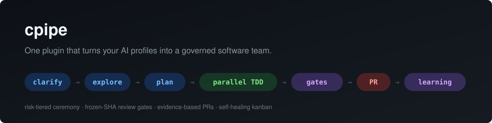

<p align="center">
  
</p>

# Hermes Software Delivery

**A structured software-delivery workflow for [Hermes Agent](https://github.com/NousResearch/hermes-agent) — shipped as one plugin.** Point it at your existing AI profiles and it routes work through them: issues are clarified, planned, implemented with TDD in worktrees, reviewed on frozen commits, verified by running the tests, and delivered as evidence-backed pull requests.

> **This is a workflow, not a team.** The plugin decides *which role* gets each card, *what the card asks for*, and *what evidence a stage must produce*. It does not provide the bots. The quality of the result depends on the Hermes profiles you map to each role: their model, their persona (`SOUL.md`), their role skills, and their toolsets. You configure those; see [Bring your own bots](#-bring-your-own-bots).

[](#-quickstart)
[](https://github.com/chryzxc/hermes-software-delivery/actions/workflows/ci.yml)
[](LICENSE)
[](https://github.com/NousResearch/hermes-agent)
[](#-bring-your-own-bots)

---

## The idea in one paragraph

This workflow is a **composition of established engineering paradigms**, not a pile of prompts. **Task-graph (DAG) engineering** decomposes issues into dependency-aware nodes that execute in parallel waves. **Loop engineering** nests four closed feedback loops — the RED→GREEN TDD loop inside a card, the implement→review→rework loop across cards, the supervisor's sense→act loop every 15 minutes, and the weekly learning loop that writes the rulebook. **Evidence-based gating** makes every claim fail-closed and machine-verifiable, **risk-tiered ceremony** scales process weight to blast radius, and **policy-as-code** keeps deterministic checks out of the LLM path. Together they turn a set of AI profiles into a delivery team whose output you can trust without reading every diff.

## What this workflow solves

AI teams move fast; trusting what they ship is the hard part. This workflow turns every delivery claim into something you can verify:

| You get | How it works |
|---|---|
| Parallelism you can trust | Independent slices run as parallel waves by default — wave plans computed from the engine's live caps, so what's promised is what runs |
| TDD by construction | RED evidence is required *before* implementation; mutation checks prove the tests bite |
| Reviews that can't drift | Gates review a frozen SHA; any base or head movement invalidates prior evidence |
| `done` means proven | After review, a Verifier card runs the change: the new tests must fail without the fix, the related tests and the CI suite must pass. A failure opens a fix card automatically |
| One source of truth | Skills deploy as symlinks from a single git-versioned repo — identical across every profile by construction |
| A board that runs itself | A deterministic supervisor keeps queues flowing, reclaims dead claims, and routes decisions to the coordinator |
| A readable conversation list | Session hygiene runs every 30 minutes: completed cron ticks are archived, stale open `cron_*` ticks are removed, and coordinator wakes are tagged as integration sessions hidden from user lists |

The result: **you review evidence, not code.**

## The flow

```
issue ──► clarify ──► explore ──► plan ──► PIN ──► TDD ──► review ──► verify ──► PR ──► learning
        intake brief   surfaces    frontier   tests    RED→    frontier   PROOF +     evidence   weekly digest
        + risk tier    artifact    model:     for      GREEN   model:     RELATED +   block +    + standards
                                  change +   today's          callers +  SUITE       approvals  loop
                                  pins       behavior         pins
                                                                  ▲           │ fail
                                                                  └── fix ◄───┘  (max 2 rounds, then you decide)
```

### Stages

| # | Stage | What happens | Required artifact | Gate to pass |
|---|---|---|---|---|
| 1 | **Clarify** | Issue becomes a brief: problem, acceptance criteria, non-goals, risk tier (LOW/MED/HIGH) | Intake brief | Brief complete — no routing on assumptions |
| 2 | **Explore** | Blast-radius investigation: affected files, modules, contract surfaces | SURFACES section | Declared surfaces match reality |
| 3 | **Plan** | Implementation plan with frozen interfaces, SHA256-locked to the card | Plan file + hash (MED/HIGH) | Plan locked; amendments supersede |
| 3b | **Pin** | Before touching source, the implementer writes a test for every caller behavior the plan marked UNPINNED, asserting what the code does *today*. They must pass on the unchanged code | `PINNED:` test list | Verify re-runs them at the merge-base |
| 4 | **Parallel TDD** | Implementer instances in per-issue worktrees: RED → IMPLEMENTING → GREEN → REGRESSION, with every pin still green | RED line before implementation | RED evidence exists |
| 5 | **Refactor** | Simplification findings become their own card — never mixed with behavior | Separate simplify card | Zero behavior change |
| 6 | **Review** | Independent review of the frozen SHA: diff, every caller of every changed symbol or route, security when triggered | `CALLERS CHECKED` list | No approval without the list |
| 6b | **Verify** | The Verifier runs the change in the same worktree: PROOF (changed tests fail at the merge-base), RELATED (tests of every changed file, every package), SUITE (repo CI commands) | Command + result per step | Any failure → `delivery_verify_failed` opens a fix card and a new verify card |
| 7 | **PR** | Draft PR generated from verified evidence; approvals batched per wave | PR with evidence block | Your one `ship N / hold N` reply |
| 8 | **Learning** | Weekly digest: flow metrics, gate effectiveness, finding classes → standards amendments | Weekly digest | You approve drafts only |

### Risk-tiered ceremony

Not every change earns the same process. The intake tier decides:

| | LOW | MED | HIGH |
|---|---|---|---|
| Trigger | ≤2 files, no contract change, existing coverage | behavior or UI change | schema/API/security boundary |
| Plan | frontier planner: CHANGE + PINS + RED | cheap map → frontier plan | + adversarial interrogation |
| Review | same-card reviewer (one-shot) | dispatched review | reviewer + QA + security in parallel |
| Verify card (PROOF/RELATED/SUITE) | yes | yes | + mutation check |

LOW cards — the majority of small issues — run 4 short sessions: plan, build, review, verify. Every worker sees only its card (the request brief plus the parent card's result), never the chat, so each session stays small.

## The concepts behind it

This isn't a pile of prompts — it's several established engineering paradigms composed into one delivery system. Knowing the vocabulary makes it easier to adopt, adapt, and trust:

| Concept | How it shows up here |
|---|---|
| **Orchestrator–worker architecture** | A coordinator role is the control plane: it routes, reconciles, and reports — never implements. Workers are disposable instances of role profiles, spawned per card by the engine dispatcher. |
| **Task-graph (DAG) engineering** | Work is decomposed into dependency-aware task nodes (`references/task-graph-flow.md`). Ready nodes execute in parallel waves; integration happens before gates, so reviews see integrated reality, not divergent branches. |
| **Loop engineering (closed feedback loops)** | Four nested loops: the RED→GREEN TDD loop inside a card; the implement→review→rework loop bounded by gates across cards; the supervisor's sense→act loop every 15 minutes; and the weekly learning loop that turns repeated findings into standards. |
| **Autonomic operation** | A deterministic supervisor keeps the board healthy on its own schedule — reclaims dead claims, refreshes queues, and routes cards that need a decision to the coordinator. |
| **Evidence-based gating (fail-closed)** | Nothing passes without machine-verifiable evidence: criteria re-run independently, frozen-SHA review, hash-locked plans, mutation checks. Missing evidence is a blocker, never a pass. |
| **Risk-tiered adaptive ceremony** | Process weight scales with blast radius — LOW/MED/HIGH tiers decided at intake from the brief's own fields, so small changes move fast and dangerous ones earn full scrutiny. |
| **Pipelined parallelism** | Independent slices decompose into parallel waves by default — no prompt needed; reviews of one wave overlap implementation of the next; same-module cards batch into one session to amortize boot cost. Parallelism comes from *instantiation* of roles, not from more bots. |
| **Pull system with WIP limits (Kanban)** | Per-profile concurrency caps, queue signals, and wave plans computed from live engine caps — never from wishful policy numbers. |
| **Deterministic-first / policy as code** | Anything expressible as a script runs without an LLM (validators, metrics, mutation checks, housekeeping); config assertions fail loudly on drift; declarative policy mirrors are validated against engine reality. |
| **Role-based least authority** | Authority ceilings attach to roles and cards; no skill, card, or model can expand them. Human approval gates (merge, deploy, credentials...) are structural, not conventional. |
| **Single-source-of-truth deployment** | The whole workflow is git-versioned and deployed idempotently — skills are symlinks, so drift across profiles is structurally impossible and `git pull && ./install.sh` is the only update path. |

## 🚀 Quickstart

Requires a working [Hermes Agent](https://hermes-agent.nousresearch.com/docs/) install with at least one profile (bot).

```sh
bash <(curl -fsSL https://raw.githubusercontent.com/chryzxc/hermes-software-delivery/main/bootstrap.sh)
```

Answer **5 questions** mapping roles to your profiles (Enter accepts defaults; the rest auto-alias). Prefer flags?

```sh
git clone https://github.com/chryzxc/hermes-software-delivery.git
cd hermes-software-delivery
./install.sh --roster coordinator=default implementer=forge reviewer=sentry verifier=sentinel security_reviewer=cypher
```

Updating: `git pull && ./install.sh` — idempotent, one step, updates skills, scripts, cron, and the plugin everywhere.

## 🤖 Bring your own bots

This repo contains **no bot names** — it ships the workflow, not a roster. Every participant is a role (Coordinator, Implementer, Reviewer, Verifier, Security Reviewer, Planner, Researcher, Designer, Release Engineer, Spike Explorer, Security Tester, Auditor, Administrator). Map them to any Hermes profiles in `~/.hermes/roster.yaml`:

```yaml
roles:
  coordinator: default      # your main agent
  implementer: my-coder     # any name you use
  reviewer: my-reviewer
  # ... 5 required, 8 optional (auto-aliased)
```

Works with 3 profiles or 13. Different team setups adopt the same workflow without touching it.

### What you configure (the workflow does not)

The plugin writes each card's brief, but a worker is still *your* profile. For every mapped role, set up:

| Per profile | Why it matters |
|---|---|
| **Model** (`config.yaml`) | Planner and reviewer make the judgment calls (what to pin, whether callers are safe): give them a frontier model. Investigator, implementer and verifier follow instructions and run commands: a cheap model is enough |
| **Persona** (`SOUL.md`) | The bot's standing rules. It must not contradict the card brief (for example, an implementer SOUL that says "run only focused tests" undoes the brief's "run related tests") |
| **Role skills** | The procedure the bot follows for its role (review checklist, TDD loop, verification steps) |
| **Toolsets and disabled skills** | Fewer tools and skills means a smaller prompt and a faster, more focused worker |

### Example bots

`workflow/bots/<role>/` holds the author's own personas and role skills (implementer, reviewer, verifier, investigator, planner), written to match the briefs. `./install.sh` copies them into the profile each role maps to, backing up any file it replaces as `*.bak-install-<timestamp>`. Roles without a mapped profile are skipped. To keep your own personas, run `SKIP_BOTS=1 ./install.sh`, and use these files as a reference for what your bots need to do.

## What's inside

```
├── plugin.yaml                  # native Hermes plugin manifest (v2)
├── software_delivery/           # plugin: agent tools + doctor CLI + hooks
├── dashboard/                   # Mission Control tab for `hermes dashboard`
├── workflow/
│   ├── bots/                    # example personas + role skills, copied into mapped profiles
│   ├── skills/                  # orchestrator policy skill + evidence/ADR/standards skills
│   ├── scripts/                 # board supervisor scan, warm-build, housekeeping, session cleanup, intelligence...
│   ├── cron.jobs.json           # 7 cron jobs: board supervisor, watchers, digests, session hygiene
│   ├── config.assertions.yaml   # engine caps this workflow expects
│   └── roster.example.yaml      # role → profile mapping template
└── install.sh                   # idempotent installer (bootstrap.sh = one-liner)
```

## Plugin tools (agent-callable, deterministic — zero LLM tokens)

- `delivery_check_policy` — validates engine caps vs policy, roster integrity, open-card requirements
- `delivery_board_intelligence` — per-stage wall-clock, queue waits, gate rejection rates, rework loops
- `delivery_mutation_check` — flips one condition in a disposable worktree and requires the focused test to fail
- `delivery_submit` — turns a request brief (max 3000 chars) into the card chain (plan → build → review → verify, or map → plan → build → review → verify for large work) and subscribes the chat to every card
- `delivery_verify_failed` — called by the Verifier on a failed verify card; opens a fix card in the same worktree plus a fresh verify card, and stops after 2 rounds

Plus the `hermes software-delivery` doctor CLI, an `on_session_end` metrics hook (append-only JSONL), and the liveness hooks described below.

## Liveness & autonomy

The chain is meant to run from plan to final report without you asking "what's next?". The pieces that keep it moving:

| Piece | What it does |
|---|---|
| Gateway dispatcher | Every 15s it claims `ready` cards **and** `review` cards (native same-card review). Linked children are promoted automatically when their parents finish, so pre-created chains need no coordinator turn between steps. |
| Dispatch telemetry | The plugin's `on_kanban_dispatch_tick` hook writes `~/.hermes/logs/dispatch-health.json`: last tick, last spawn, and why each held card was held (per-profile cap, respawn guard, unassigned…). |
| Stall supervisor | The cron scan reads that telemetry. A card waiting behind the per-profile cap shows up as `QUEUED_AT_CAP` (informational), not as a stall. A real stall is `READY_STUCK`/`REVIEW_STALLED` with the engine's hold reason attached, and `DISPATCHER_SILENT` means the gateway stopped ticking. It also surfaces cards nothing else would wake: `TRIAGE_PARKED`, `BLOCKED_NO_REASON`, and review verdicts parked in block reasons (`VERDICT_PARKED`). |
| Board triage | Every 2h a deterministic cron retries blocked cards that only hit a rate limit or timeout (twice at most, never while the provider is still rate limiting) and moves reason-less blocked children back to wait on their parent. Once a day, or when a new decision is needed, it sends you a digest grouped as *needs your decision / looks done / blocked by old rules / parked*. Reply `continue <id> <what to do>`, `archive <id>` or `resubmit <id>` and the coordinator acts on it. |
| Mission Control | A dashboard tab (`hermes dashboard` → Mission Control) with the same groups. Open a card to read its reason, body and latest comments, then Continue with a note, Resubmit it fresh under the current flow, or Archive. Tick several for bulk actions. |
| Session notice | The plugin's `pre_llm_call` hook tells the next chat turn when ESTOP is holding work or the dispatcher has gone silent, once per session. |

**Emergency stop.** `~/.hermes/ESTOP` (for example the Dock's pause control) pauses the dispatcher **and every cron job, including the stall supervisor**. Work stops on purpose and nothing reports it, except the session notice and the doctor. Agents are told never to lift it and never to bypass it with `hermes kanban dispatch`, because that manual pass ignores ESTOP. Run `hermes resume` when you want work to continue.

**Troubleshooting a stalled board:** run `hermes software-delivery` (the doctor). It prints ESTOP state, the dispatcher's last tick and spawn, the current holds grouped by reason, when the supervisor last ran, and board counts. The hooks only load after `./install.sh` and a gateway restart.

## The learning loop

The weekly digest reports per-stage wall-clock, queue waits, gate rejection rates, and finding classes. Any review finding class appearing 3+ times auto-drafts an amendment to the engineering-standards skill — **the workflow writes its own rulebook**. A gate silent for two weeks is flagged fix-or-remove.

## Safety model

- `delivery_check_policy`, `delivery_board_intelligence`, and `delivery_mutation_check` are read-only; `delivery_submit` and `delivery_verify_failed` only create Kanban cards and subscriptions
- The board supervisor writes only Kanban cards and profile skill installs; repositories remain untouched
- `./install.sh` writes the example bots into your mapped profiles unless `SKIP_BOTS=1`, and backs up every file it replaces
- Human approval gates are unchanged and always yours: merge, deploy, production, credentials, purchases, publishing, irreversible deletion
- `delivery_mutation_check` mutates only a disposable git worktree file and restores it
- The engine install (`~/.hermes/hermes-agent`) is never modified — everything lives in the user-state layer and survives `hermes update`

## FAQ

**Does it work with fewer than 13 profiles?** Yes — 5 required roles, the rest alias automatically. Even 3 profiles work (roles share profiles).

**Does one implementer bot serialize work?** No — a bot is a profile, and workers are disposable instances of it. The engine runs up to `max_in_progress_per_profile` concurrent workers per bot and the dispatcher alone decides spawning; coordination agents never block ready work for capacity (the supervisor detects and requeues such mistakes).

**Will `hermes update` remove it?** No. Everything installs into the Hermes user-state layer; the updater only touches the engine checkout. Run `./install.sh` after an update to re-assert everything.

**Does it cost more tokens?** Less, usually: tiering skips the plan session for low-risk work, the verify card runs commands instead of re-reading code, reviews batch multiple commits per session, and every check expressible as a script runs without an LLM.

**Can I use it on multiple machines?** Clone, `./install.sh`, done — same workflow everywhere.

**Is there a CI badge?** Yes — GitHub Actions runs the full pytest suite on every push and PR to `main`.

## Contributing

Issues and PRs welcome. Run the tests before submitting:

```sh
uv venv && uv pip install --python .venv "pytest>=8,<9"
.venv/bin/python -m pytest -q
```

## License

[MIT](LICENSE) © 2026 Christian Rey Villablanca
